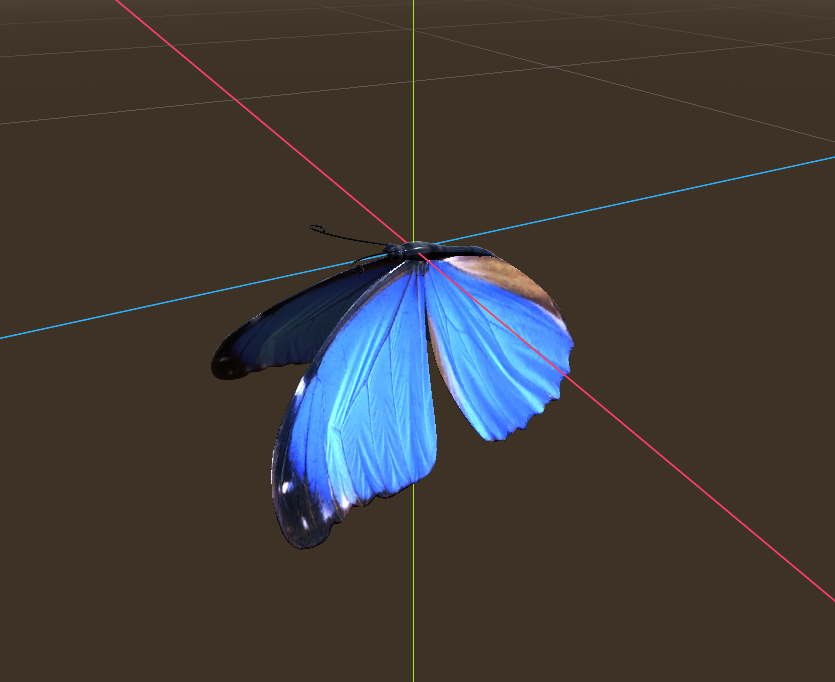

# Fetch

> *A peaceful VR experience with your loyal dog companion*

**Creator:** Lovely Fernandez (C20305696)  
**Class:** TU858-4  
**GitHub:** [https://github.com/vedez/Fetch](https://github.com/vedez/Fetch)

## Description

Fetch is a serene VR simulation where you enjoy a peaceful stroll through a meticulously designed park with your faithful canine companion. Experience the simple joy of throwing a ball and watching your dog eagerly chase after it, bringing it back to you with animated enthusiasm.

Immerse yourself in a vibrant environment filled with:
- Fluttering butterflies that respond to your commands
- Buzzing bees exploring the park
- Ambient bird sounds creating a peaceful atmosphere
- Beautiful scenery with a pond, gazebo, and sitting areas

This experience is about finding happiness in small, everyday moments—just like in real life.

## Screenshots

<table>
  <tr>
    <td></td>
    <td></td>
  </tr>
  <tr>
    <td></td>
    <td></td>
  </tr>
  <tr>
    <td></td>
    <td></td>
  </tr>
</table>

## Controls

### VR Controls
- **Left/Right Trigger:** Grab and throw the ball
- **B Button:** Increase butterflies in the park
- **A Button:** Decrease butterflies
- **X Button:** Reset ball position
- **Left Stick Click:** Toggle debug mode
- **Left Stick Movement:** Move player (in debug mode only)

## How It Works

The game features several key components:

1. **Dog AI System**: The dog navigates using a NavMesh system, intelligently following thrown balls, picking them up, and returning them to the player. When not navigating to a ball, the dog wanders the park and explores its environment.

2. **Interactive Ball Physics**: Realistic ball physics with throw mechanics and detection of when the ball has landed on the ground.

3. **Butterfly & Bee Systems**: Dynamic spawning and movement of nature elements that add life to the environment. Bees randomly land on flowers and explore the park, butterflies float around gracefully.

4. **VR Interaction**: This is a full VR experience which gives a level of immersion unlike any other.

## Technologies & Tools

This project was created using:
- **Godot Engine 4.4** with OpenXR support
- **GDScript** for all gameplay logic
- **3D Models** sourced from open source and high-quality asset libraries

## Classes & Assets

| Class/Asset | Description | Source |
|-------------|-------------|--------|
| `dog.gd` | Core dog AI behavior with navigation, animation, wandering, and fetch mechanics | Self-written |
| `ball.gd` | Physics-based ball with throw mechanics and settling detection | Self-written |
| `player.gd` | VR player controls and interaction | Self-written |
| `butterfly_manager.gd` | System for spawning and managing butterflies | Self-written |
| `bees.gd` | Bee movement and behavior, such as flower detection | Self-written |
| 3D Models | Park environment, animals, and objects | [Poly Pizza](https://poly.pizza/) |

## Inspiration & References

- 3D models sourced from [Poly Pizza](https://poly.pizza/)
- Nature soundscapes and ambient effects

## Highlights

I'm most proud of the fetch mechanic and the realistic, responsive interaction between the user and the dog. The way the dog reacts to the player's actions adds a strong sense of immersion and emotional connection, making the experience feel much more lifelike.

The environment design closely simulates a real-life outdoor park. From the layout and lighting to the ambient sounds and natural movement of elements like grass and trees, every detail was crafted to enhance immersion and make the virtual space feel familiar and believable.

## What I Learned

This project allowed me to develop skills in:
- Advanced AI behavior programming
- VR interaction design
- Environmental storytelling
- Real-time physics simulation
- Creating emotionally engaging experiences through subtle design choices

